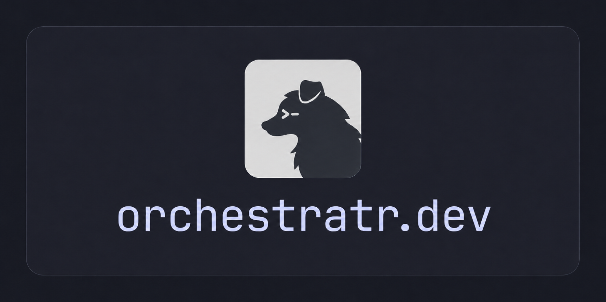

<p align="center">
  
</p>

---

a cross-provider orchestrator for AI coding agents, built on [herdr](https://herdr.dev). run,
coordinate, and schedule agents (claude, codex, …) as managed, addressable processes — each
lives at a **path**, settles on a **turn boundary**, and cleans up on a policy you choose.
drive it from the CLI, the TypeScript SDK, or the installable skill that teaches any agent the
vocabulary.

## install

grab a prebuilt `orcr` from [GitHub releases](../../releases) — macOS (`macos-arm64`,
`macos-x64`) and Linux (`linux-x64`); each `orcr-<version>-<platform>.tar.gz` ships a `.sha256`:

```sh
tar -xzf orcr-<version>-<platform>.tar.gz && mv orcr /usr/local/bin/
```

or build from source (Rust ≥ 1.89):

```sh
cargo install orchestratr    # installs the `orcr` binary
# or, from a checkout:
cargo build --release        # → target/release/orcr
```

the SDK isn't on npm yet — `orcr scaffold` sets up a project with `@orchestratr/sdk`
pre-installed (pinned to the CLI's version); see [quickstart (SDK)](#quickstart-sdk).

`orcr` needs a running herdr on your PATH with the claude/codex integrations installed
(`orcr server status` shows what's available). only `orcr scaffold` and the SDK need Node
(≥ 20).

## quickstart (CLI)

```sh
# spawn an agent (naming is mandatory: --name or --path). prints "<path> <uuid>".
orcr agent run --name reviewer -a codex -p "Review src/auth.ts for auth bugs. Say DONE."

orcr agent wait reviewer                 # block until it settles
orcr agent logs reviewer --last-response # read its answer
orcr agent send reviewer "Also check the refresh-token path."
orcr agent kill "review/**" -y           # clean up a subtree

orcr top                                 # live, view-only dashboard of the path tree
```

paths are relative to your scope (`/` = absolute); `*` = one segment, `**` = any depth.

## quickstart (SDK)

```sh
orcr scaffold my-workflow && cd my-workflow
npx tsx workflow.ts
```

```ts
import { orcr } from "@orchestratr/sdk";

await orcr.scope("review", async () => {
  const reviewers = await Promise.all(files.map((f, i) =>
    orcr.agent.run({ agent: "claude", path: `fanout/file_${i}`, gc: "immediate",
      prompt: `Review ${f}. Write findings to $ORCR_AGENT_DATA_DIR/response.md, then say DONE.` })));
  await orcr.agent.wait("fanout/*");
  // read each reviewers[i].dataDir/response.md, then synthesize …
});
```

the SDK is a typed client of the socket API — anything the CLI can do, the SDK can do. see
[`skill/references/sdk.md`](skill/references/sdk.md).

## schedule (loops)

```sh
orcr loop create nightly "0 2 * * *" --timeout 25m -- \
  ~/.orcr/workflows/nightly/node_modules/.bin/tsx ~/.orcr/workflows/nightly/run.ts
orcr loop ls
```

## concepts

- **identity** — every agent has a permanent `uuid` and a human `path`; the last segment is its
  name. children nest under your scope; glob patterns operate on subtrees.
- **completion** — `wait` settles on turn-complete (live agents) or `ended (completed)`
  (`--gc immediate`). never parse terminal output; use `--last-response` or the file convention.
- **data** — `~/.orcr/data/` mirrors the path tree; each agent gets `$ORCR_AGENT_DATA_DIR`
  (see [`skill/references/files.md`](skill/references/files.md)).
- **the skill** — [`skill/SKILL.md`](skill/SKILL.md) teaches any agent the orcr vocabulary
  (decision ladder, hot path, guard rails, provider routing).

## development

```sh
cargo test                          # unit + fast tests
cargo clippy --all-targets          # lint
(cd sdk/ts && npm install && npm test && npm run codegen:check)   # SDK tests + drift check
ORCR_E2E=1 cargo test -- --test-threads=1   # e2e against live herdr + the mock provider
```

the SDK installs locally via `orcr scaffold` (which pins `@orchestratr/sdk` to the CLI's own
version) — set `ORCR_SDK_SPEC` to a local `file:`/tarball path for offline installs.

## license

orchestratr is **dual-licensed**:

- **open source** — [GNU AGPL-3.0-or-later](LICENSE).
- **commercial** — for organizations that cannot comply with the AGPL; contact
  `hey@orchestratr.dev`.

see [`LICENSE`](LICENSE) for the full text.
